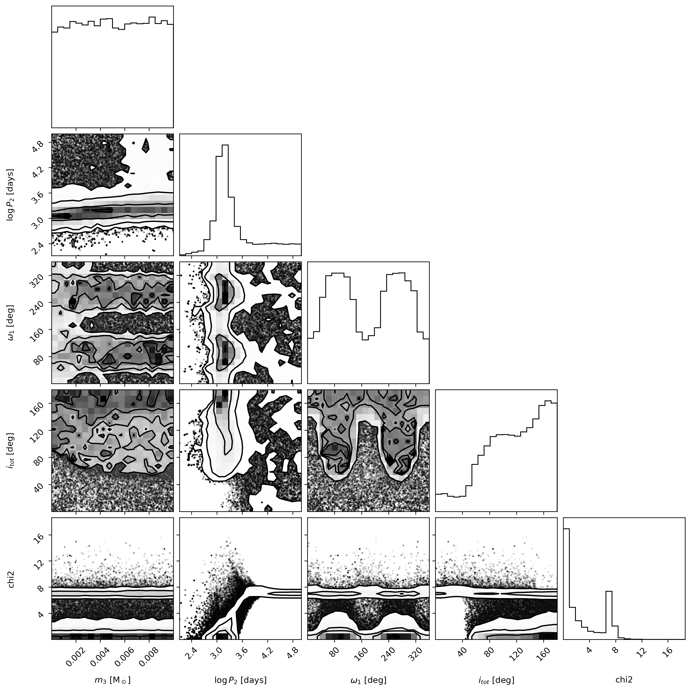
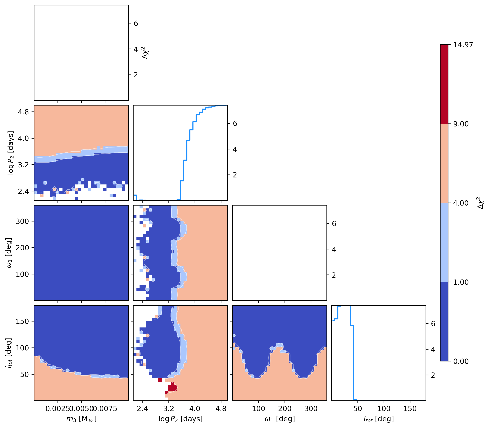

# Chi-Squared Corner Plotter

This repository contains a Python script, `plot_corner_chi2.py`, designed for generating corner plots. These plots visualize the minimum $\chi^2$ (chi-squared) values across pairs of parameters and also show 1D marginalized minimum $\chi^2$ profiles. 

This type of visualization is particularly insightful for analyzing parameter spaces, for instance, from MCMC (Markov Chain Monte Carlo) sampling, especially when dealing with complex or "poorly conditioned" likelihood surfaces where traditional density-based corner plots might look messy.

## Example Visualizations

**Traditional Density-Based Corner Plot (e.g., using the `corner` package):**
This type of plot shows the density of samples.



**Minimum $\chi^2$ Corner Plot (using this tool):**
This plot, generated by `plot_corner_chi2.py`, specifically shows the *minimum* $\chi^2$ value found within each bin of the parameter space.



## Features

*   Generates 2D contour plots showing the minimum $\chi^2$ in binned projections of two parameters.
*   Generates 1D profiles showing the marginalized minimum $\chi^2$ for each individual parameter.
*   Calculates and plots $\Delta \chi^2$ relative to the global minimum $\chi^2$ found in the dataset, aiding in the visualization of confidence regions (e.g., $\Delta \chi^2 = 1, 4, 9$ corresponding to 1, 2, 3 sigma if the chi2 is correctly computed).
*   Customizable colormap and number of bins for tailored visualizations.
*   Built with standard scientific Python libraries: `matplotlib`, `numpy`, `pandas`, and `scipy`.

## `plot_corner_chi2.py`

The core of this repository is the `plot_corner_chi2` function:

```python
def plot_corner_chi2(samples_df: pd.DataFrame,
                     param_labels: list[str],
                     colormap: Colormap, # from matplotlib.colors
                     nbins: int,
                     chi2_col: str = 'chi2') -> Figure: # from matplotlib.figure
```

### Arguments:
*   `samples_df` (pd.DataFrame): A Pandas DataFrame containing columns for each parameter and a column for the $\chi^2$ values. The script assumes this DataFrame is cleaned (i.e., no NaNs or Infs in the relevant parameter and $\chi^2$ columns).
*   `param_labels` (list[str]): A list of strings to be used as labels for the parameters on the plot axes. The order of labels must correspond to the order of parameter columns derived from `samples_df` (i.e., all columns except `chi2_col`).
*   `colormap` (matplotlib.colors.Colormap): A Matplotlib colormap object (e.g., `plt.cm.get_cmap('viridis_r')`) to be used for the 2D $\Delta \chi^2$ maps.
*   `nbins` (int): The number of bins to use for both the 1D histograms and the 2D grid for `binned_statistic`.
*   `chi2_col` (str, optional): The name of the column in `samples_df` that contains the $\chi^2$ values. Defaults to `'chi2'`.

### Returns:
*   `matplotlib.figure.Figure`: The generated Matplotlib figure object containing the corner plot.

## Installation / Dependencies

The script requires the following Python libraries:

*   `pandas`
*   `numpy`
*   `scipy`
*   `matplotlib`

You can install these dependencies using pip:
```bash
pip install pandas numpy scipy matplotlib
```
Or, if you have a `requirements.txt` file (as provided in this repository):
```bash
pip install -r requirements.txt
```

## Usage Example

To use the `plot_corner_chi2.py` script, you'll typically have a CSV file (or another data source that can be loaded into a Pandas DataFrame) containing your parameter samples and corresponding $\chi^2$ values. A sample csv is provided in `data`, which is used to generate the figure above using the following script

```python
import pandas as pd
import numpy as np
import matplotlib.pyplot as plt
from chisqcorner import plot_corner_chi2

# --- Configuration ---
data_file_path = 'data/samples.csv'
output_plot_path = 'figures/corner_chi2.png'

parameter_column_names = ['m3_msun', 'log_p2_days', 'omega_1_deg', 'i_tot_deg']
chi2_column_name = 'chi2'

plot_param_labels = [r'$m_3$ [M$_\odot$]', r'$\log P_2$ [days]', r'$\omega_1$ [deg]', r'$i_{tot}$ [deg]']

num_plot_bins = 30
plot_colormap = plt.cm.coolwarm

# --- Load data ---
samples_raw = pd.read_csv(data_file_path)
samples_for_plot = samples_raw[parameter_column_names + [chi2_column_name]]
samples_for_plot.replace([np.inf, -np.inf], np.nan, inplace=True)
samples_for_plot.dropna(inplace=True)

# --- Plot ---
figure = plot_corner_chi2(
    samples_df=samples_for_plot,
    param_labels=plot_param_labels,
    colormap=plot_colormap,
    nbins=num_plot_bins,
    chi2_col=chi2_column_name
)

figure.savefig(output_plot_path, dpi=300, bbox_inches='tight')
plt.close()
```

## License
This project is licensed under the MIT License.